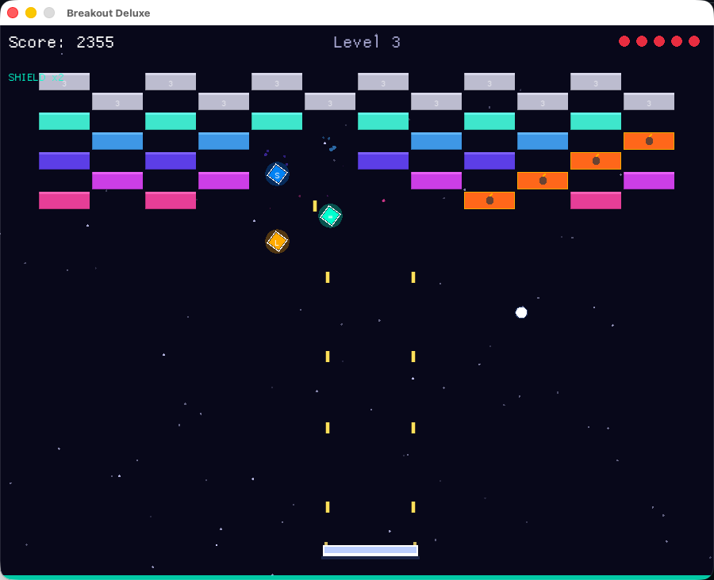

# Breakout Deluxe

A feature-rich Breakout clone built with **Rust** and **[Macroquad](https://macroquad.rs/)**.



## Features

- **Built-in Laser Cannons** - Hold click or spacebar to shoot bullets from the paddle
- **8 Unique Level Patterns** - Diamond, checkerboard, zigzag, V-shape, fortress, and more, cycling with increasing difficulty
- **5 Brick Types**
  - Normal / Tough (2 HP) / Armored (3 HP with HP display)
  - Explosive - chain-reaction blast that destroys nearby bricks
  - Indestructible - steel blocks that cannot be broken
  - Moving - rainbow bricks that slide left and right
- **10 Powerups** (30% drop chance from destroyed bricks)
  - Multi Ball, Wide Paddle, Rapid Fire, Slow Ball, Extra Life, Shield, Fire Ball (pierces bricks), Magnet (ball sticks to paddle)
  - Negative: Shrink Paddle, Speed Up
- **Combo System** - consecutive brick hits multiply your score
- **Particle Effects & Screen Shake** - explosions, floating score text, fire trails
- **Mouse + Keyboard Controls** - move with mouse or A/D keys, click or spacebar to shoot and launch

## Controls

| Action | Input |
|--------|-------|
| Move paddle | Mouse / A / D / Arrow keys |
| Shoot lasers | Hold Left Click / Space |
| Launch ball | Click / Space |
| Start / Restart | Click / Enter |

## Build & Run

```bash
# Debug
cargo run

# Release (recommended)
cargo build --release
./target/release/breakout
```

### macOS .app Bundle

```bash
cargo build --release
mkdir -p Breakout.app/Contents/MacOS
cp target/release/breakout Breakout.app/Contents/MacOS/
# Then double-click Breakout.app
```

## Requirements

- Rust 1.70+
- macOS / Linux / Windows

## License

MIT
